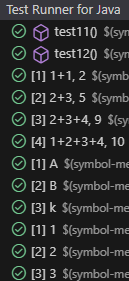
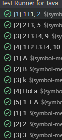

# Practica-3-AIS

Nombre de los alumnos: Raul Sanchez Benitez y Andres Muñoz Muñoz.


## Ejemplo 1

**INPUT y OUTPUT**: "1" -> "1"

**EJ1. Código de test**
```java
@Test
public void test1() {
    CalculatorParser calculator = new CalculatorParser();
    assertTrue(calculator.parse("1") == 1);
}
```

**EJ1. Mensaje del test añadido que NO PASA**

```log
java.lang.UnsupportedOperationException: Not implemented yet
```

**EJ1. Código mínimo para que el test pase**

Hemos hecho que devuelva 1 para que pase el test.

```java
public int parse(String expression) {
    return 1;
}
```

**EJ1. Captura de que TODOS los test PASAN**


**EJ1. Refactorización**
> No es necesaria.


<br>

## Ejemplo 2

**INPUT y OUTPUT**: "2" -> "2"

**EJ2. Código de test**
```java
@Test
public void test2(){
    CalculatorParser calculator = new CalculatorParser();
    assertEquals(calculator.parse("2"), 2);
}
```

**EJ2. Mensaje del test añadido que NO PASA**

```log
org.opentest4j.AssertionFailedError: expected: [1] but was: [2]
```

**EJ2. Código mínimo para que el test pase**

Ahora tenemos que cambiar el código para que pase los dos tests.

```java
public int parse(String expression) {
    if (expression == "1"){
        return 1;
    }else {
        return 2;
    }
}
```

**EJ2. Captura de que TODOS los test PASAN**


**EJ2. Refactorización**
> No es necesaria.


<br>


## Ejemplo 3

**INPUT y OUTPUT**: "3" -> "3"

**EJ3. Código de test**
```java
@Test
public void test3(){
    CalculatorParser calculator = new CalculatorParser();
    assertEquals(calculator.parse("3"), 3);
}
```

**EJ3. Mensaje del test añadido que NO PASA**

org.opentest4j.AssertionFailedError: expected: [2] but was: [3]

**EJ3. Código mínimo para que el test pase**

Ahora tenemos que cambiar el código para que pase los 3 tests.

```java
public int parse(String expression) {
    if (expression == "1"){
        return 1;
    }else if (expression == "2"){
        return 2;
    }else{
        return 3;
    }
}
```

**EJ3. Captura de que TODOS los test PASAN**


**EJ3. Refactorización**
> Vamos a refactorizar el metodo para eliminar el codigo duplicado, al igual que los tests cambiandolos a un test parametrizado.


```java
public int parse(String expression) {
    return Integer.parseInt(expression);
}
```
```java
@ParameterizedTest
@ValueSource(strings = {"1", "2", "3"})
public void testSingleNumbers(String input) {
    CalculatorParser calculator = new CalculatorParser();
    assertEquals(Integer.parseInt(input), calculator.parse(input));
}
```

**EJ3. Captura de que TODOS los tests PASAN tras la refactorización**


<br>

## Ejemplo 4

**INPUT y OUTPUT**: "1+1" -> "2"

**EJ4. Código de test**
```java
@Test
public void test4(){
    CalculatorParser calculator = new CalculatorParser();
    assertEquals(calculator.parse("1+1"), 2);
}
```

**EJ4. Mensaje del test añadido que NO PASA**

```log
java.lang.NumberFormatException: For input string: "1+1"
```

**EJ4. Código mínimo para que el test pase**

Se añade un if con el "1+1".

```java
public int parse(String expression) {
    if (expression == "1+1") {
        return 2;
    } else {
        return Integer.parseInt(expression);
    }
}
```

**EJ4. Captura de que TODOS los test PASAN**


**EJ4. Refactorización**
> No es necesaria.


<br>

## Ejemplo 5

**INPUT y OUTPUT**: "2+3" -> "5"

**EJ5. Código de test**
```java
@Test
public void test5(){
    CalculatorParser calculator = new CalculatorParser();
    assertEquals(calculator.parse("2+3"), 5);
}
```

**EJ5. Mensaje del test añadido que NO PASA**

```log
java.lang.NumberFormatException: For input string: "2+3"
```

**EJ5. Código mínimo para que el test pase**

Se añade otro if con el "2+3".
```java
public int parse(String expression) {
    if (expression == "1+1") {
        return 2;
    } else if (expression == "2+3") {
        return 5;
    } else {
        return Integer.parseInt(expression);
    }
}
```

**EJ5. Captura de que TODOS los test PASAN**


**EJ5. Refactorización**
> Como solo hemos duplicado codigo 2 veces vamos a esperar a ver si duplicamos otra vez para refactorizar aplicando la regla del 3 del codigo duplicado. 


<br>


## Ejemplo 6

**INPUT y OUTPUT**: "2+3+4" -> "9"

**EJ6. Código de test**
```java
@Test
public void test6(){
    CalculatorParser calculator = new CalculatorParser();
    assertEquals(calculator.parse("2+3+4"), 9);
}
```

**EJ6. Mensaje del test añadido que NO PASA**

```log
java.lang.NumberFormatException: For input string: "2+3+4"
```

**EJ6. Código mínimo para que el test pase**

Añadimos otro if para el nuevo caso "2+3+4"

```java
public int parse(String expression) {
    if (expression == "1+1") {
        return 2;
    } else if (expression == "2+3") {
        return 5;
    } else if (expression == "2+3+4") {
        return 9;
    } else {
        return Integer.parseInt(expression);
    }
}
```

**EJ6. Captura de que TODOS los test PASAN**


**EJ6. Refactorización**
> Como ya hemos duplicado codigo 3 veces, procedemos a refactorizar el método, extrayendo el código duplicado y añadiendo la funcionalidad de sumar. En cuanto a los test, vamos a meter un "@beforeEach" y vamos a crear un test parametrizado para los casos de uso de las sumas.

```java
public int parse(String expression) {
    String[] tokens = expression.split("\\+");
    int result = 0;
    for (String token : tokens) {
        result += Integer.parseInt(token.trim());
    }
    return result;
}
```

```java
@ParameterizedTest
@CsvSource({"1+1, 2" , "2+3, 5" , "2+3+4, 9"})
public void testSums(String expression, int expected) {
    assertEquals(expected, calculator.parse(expression));
}
```
**EJ6. Captura de que TODOS los tests PASAN tras la refactorización**


<br>

## Ejemplo 7

**INPUT y OUTPUT**: "1+2+3+4" -> "10"

**EJ7. Código de test**
```java
@Test
public void test7(){
    CalculatorParser parser = new CalculatorParser();
    assertEquals(parser.parse("1+2+3+4"), 10);
}
```

**EJ7. Mensaje del test añadido que NO PASA**

El test si que pasa con la implementación anterior.

**EJ7. Código mínimo para que el test pase**

Es el mismo código que el anterior.
```java
public int parse(String expression) {
    expression = expression.trim();
    if (expression.contains("+")) {
        String[] parts = expression.split("\\+", 2);
        return parse(parts[0]) + parse(parts[1]);
    }
    return Integer.parseInt(expression.trim());
}
```

**EJ7. Captura de que TODOS los test PASAN**


**EJ7. Refactorización**
> En este caso solo vamos meter el nuevo test dentro de los casos del test parametrizado de las sumas.

```java
@ParameterizedTest
@CsvSource({"1+1, 2" , "2+3, 5" , "2+3+4, 9" , "1+2+3+4, 10"})
public void testSums(String expression, int expected) {
    assertEquals(expected, calculator.parse(expression));
}
```
**EJ7. Captura de que TODOS los tests PASAN tras la refactorización**


<br>


## Ejemplo 8

**INPUT y OUTPUT**: "A" -> "Invalid expression"

**EJ8. Código de test**
```java
@Test
public void test8(){
    CalculatorParser parser = new CalculatorParser();
    IllegalArgumentException exception = assertThrows(IllegalArgumentException.class, () -> parser.parse("A"));
    assertEquals("Invalid expression", exception.getMessage());
}
```

**EJ8. Mensaje del test añadido que NO PASA**

```log
org.opentest4j.AssertionFailedError: expected: [Invalid expression] but was: [For input string: "A"]
```

**EJ8. Código mínimo para que el test pase**

Hemos cambiado el método para que al tener "A" se lance la excepción con el mensaje de "Invalid expression".

```java
public int parse(String expression) {
    if (expression == "A") {
        throw new IllegalArgumentException("Invalid expression");
    }
    String[] tokens = expression.split("\\+");
    int result = 0;
    for (String token : tokens) {
        result += Integer.parseInt(token.trim());
    }
    return result;
}
```

**EJ8. Captura de que TODOS los test PASAN**


**EJ8. Refactorización**
> No es necesaria.


<br>


## Ejemplo 9

**INPUT y OUTPUT**: "B" -> "Invalid expression"

**EJ9. Código de test**
```java
@Test
public void test9(){
    CalculatorParser parser = new CalculatorParser();
    IllegalArgumentException exception = assertThrows(IllegalArgumentException.class, () -> parser.parse("B"));
    assertEquals("Invalid expression", exception.getMessage());
}
```

**EJ9. Mensaje del test añadido que NO PASA**

```log
org.opentest4j.AssertionFailedError: expected: [Invalid expression] but was: [For input string: "B"]
```

**EJ9. Código mínimo para que el test pase**

Hemos incluido otro "if" para la entrada "B".

```java
public int parse(String expression) {
    if (expression == "A") {
        throw new IllegalArgumentException("Invalid expression");
    } else if (expression == "B") {
        throw new IllegalArgumentException("Invalid expression");
    }
    String[] tokens = expression.split("\\+");
    int result = 0;
    for (String token : tokens) {
        result += Integer.parseInt(token.trim());
    }
    return result;
}
```

**EJ9. Captura de que TODOS los test PASAN**


**EJ9. Refactorización**
> De nuevo, vamos a esperar a ver si se duplica código una tercera vez para refactorizar, aplicando la regla del 3 del codigo duplicado.


<br>

## Ejemplo 10

**INPUT y OUTPUT**: "k" -> "Invalid expression"

**EJ10. Código de test**
```java
@Test
public void test10(){
    CalculatorParser parser = new CalculatorParser();
    IllegalArgumentException exception = assertThrows(IllegalArgumentException.class, () -> parser.parse("k"));
    assertEquals("Invalid expression", exception.getMessage());
}
```

**EJ10. Mensaje del test añadido que NO PASA**

```log
org.opentest4j.AssertionFailedError: expected: [Invalid expression] but was: [For input string: "k"]
```

**EJ10. Código mínimo para que el test pase**

Añadimos la letra k.

```java
public int parse(String expression) {
    if (expression == "A") {
        throw new IllegalArgumentException("Invalid expression");
    } else if (expression == "B") {
        throw new IllegalArgumentException("Invalid expression");
    } else if (expression == "k") {
        throw new IllegalArgumentException("Invalid expression");
    }
    String[] tokens = expression.split("\\+");
    int result = 0;
    for (String token : tokens) {
        result += Integer.parseInt(token.trim());
    }
    return result;
}
```

**EJ10. Captura de que TODOS los test PASAN**


**EJ10. Refactorización**
> Hemos duplicado código por tercera vez, por lo que toca refactorizar. Vamos a hacer que cuando la entrada sea una letra mayuscula o minuscula salte la excepción. En los tests, igual que en los casos de antes vamos a hacer un test parametrizado, en este caso para las entradas con letras.

```java
public int parse(String expression) {
    if (expression.matches("[a-zA-Z]")) {
        throw new IllegalArgumentException("Invalid expression");
    }
    String[] tokens = expression.split("\\+");
    int result = 0;
    for (String token : tokens) {
        result += Integer.parseInt(token.trim());
    }
    return result;
}
```

```java
@ParameterizedTest
@ValueSource(strings = { "A", "B", "k" })
public void testInvalidExpressions(String expression) {
    IllegalArgumentException exception = assertThrows(IllegalArgumentException.class,
            () -> calculator.parse(expression));
    assertEquals("Invalid expression", exception.getMessage());
}
```
**EJ10. Captura de que TODOS los tests PASAN tras la refactorización**


<br>

## Ejemplo 11

**INPUT y OUTPUT**: "HoLa" -> "Invalid expression"

**EJ11. Código de test**
```java
@Test
public void test11(){
    CalculatorParser parser = new CalculatorParser();
    IllegalArgumentException exception = assertThrows(IllegalArgumentException.class, () -> parser.parse("HoLa"));
    assertEquals("Invalid expression", exception.getMessage());
}
```

**EJ11. Mensaje del test añadido que NO PASA**

```log
org.opentest4j.AssertionFailedError: expected: [Invalid expression] but was: [For input string: "HoLa"]
```

**EJ11. Código mínimo para que el test pase**

Metemos el "if" para el caso de la entrada "HoLa".

```java
public int parse(String expression) {
    if (expression.matches("[a-zA-Z]")) {
        throw new IllegalArgumentException("Invalid expression");
    } else if (expression == "HoLa") {
        throw new IllegalArgumentException("Invalid expression");
    }
    String[] tokens = expression.split("\\+");
    int result = 0;
    for (String token : tokens) {
        result += Integer.parseInt(token.trim());
    }
    return result;
}
```

**EJ11. Captura de que TODOS los test PASAN**


**EJ11. Refactorización**
> Vamos a unificar el caso "HoLa" dentro de la expresión existente ([a-zA-Z]+) que valida si la entrada contiene únicamente letras. Esta refactorización la hacemos para mantener el código simple y mantenible, evitando tener multiples ifs. En los tests simplemente metemos el nuevo caso dentro del test parametrizado.

```java
public int parse(String expression) {
    if (expression.matches("[a-zA-Z]+")) {
        throw new IllegalArgumentException("Invalid expression");
    }
    String[] tokens = expression.split("\\+");
    int result = 0;
    for (String token : tokens) {
        result += Integer.parseInt(token.trim());
    }
    return result;
}
```
**EJ11. Captura de que TODOS los tests PASAN tras la refactorización**


<br>

## Ejemplo 12

**INPUT y OUTPUT**: "1 + A" -> "Invalid expression"

**EJ12. Código de test**
```java
@Test
public void test12(){
    CalculatorParser parser = new CalculatorParser();
    IllegalArgumentException exception = assertThrows(IllegalArgumentException.class, () -> parser.parse("1 + A"));
    assertEquals("Invalid expression", exception.getMessage());
}
```

**EJ12. Mensaje del test añadido que NO PASA**

org.opentest4j.AssertionFailedError: expected: <Invalid expression> but was: <For input string: "A">

**EJ12. Código mínimo para que el test pase**

Metemos el if para el nuevo caso.

```java
public int parse(String expression) {
    if (expression.matches("[a-zA-Z]+")) {
        throw new IllegalArgumentException("Invalid expression");
    } else if (expression == "1 + A") {
        throw new IllegalArgumentException("Invalid expression");
    }
    String[] tokens = expression.split("\\+");
    int result = 0;
    for (String token : tokens) {
        result += Integer.parseInt(token.trim());
    }
    return result;
}
```

**EJ12. Captura de que TODOS los test PASAN**



**EJ12. Refactorización**
> Se ha eliminado la condición específica para "1 + A" y se ha reemplazado por una validación más general y robusta, que asegura que todos los tokens separados por + sean numéricos. Eliminamos código hardcodeado que no escala ni es mantenible.
```java
public int parse(String expression) {
    if (expression.matches("[a-zA-Z]+")) {
        throw new IllegalArgumentException("Invalid expression");
    }

    String[] tokens = expression.split("\\+");
    int result = 0;
    for (String token : tokens) {
        String trimmed = token.trim();
        if (!trimmed.matches("\\d+")) {
            throw new IllegalArgumentException("Invalid expression");
        }
        result += Integer.parseInt(trimmed);
    }
    return result;
}
```

**EJ12. Captura de que TODOS los tests PASAN tras la refactorización**




<br>